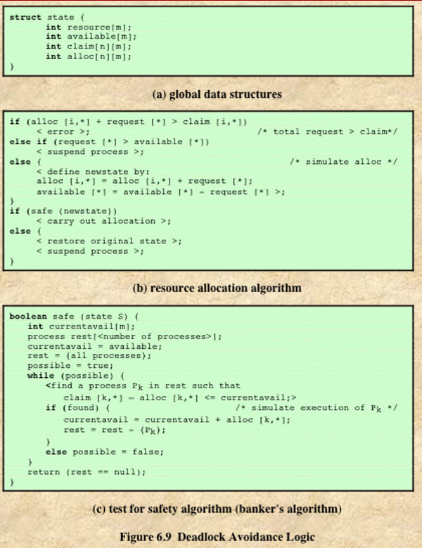

# Bankers Algorithm

## Project objective
Implement and experiment with the Banker's algorithm presented in the section titled Dynamic deadlock avoidance.

## Description
The Banker's algorithm uses a claim graph consisting of processes, multi-unit resources, request edges, allocation edges, and claim edges.

The graph can be represented by a set of arrays:

The number of units of each resource is represented as a one-dimensional array `R[m]` (Resource vector), where `m` is the number of resources and each entry `R[j]` records the number of units of resource `Rⱼ`.
The maximum claims are represented as a two-dimensional array `P[n][m]` where each entry `P[i][j]` contains an integer that records the maximum number of units of resource `Rⱼ` that process `pᵢ` will ever request.
The allocation edges and the request edges are represented using analogous arrays.

## Assignment
Develop an interactive program that first reads the description of a system from the command line or from a file. The description consists of the number of processes, the number of resources, the numbers of units within each resource, and the maximum claims of each process.
Using the given information, the program creates the current representation of the system (the set of arrays).
The program then enters an interactive session during which the user inputs commands of the form:

        request(i, j, k) or release(i, j, k),

where `i` is a process number, `j` is a resource number, and `k` is the number of units of `Rⱼ` the process `pᵢ` is requesting or releasing.
For each request operation, the program responds whether the request has been granted or denied. If granted output a safe execution sequence for the processes.
Demonstrate the functioning of the banker's algorithm by inputting a sequence of requests and releases that, without using the Banker's algorithm, would lead to a deadlock.

## Implementation

You may implement this simulation using any programming language of your choice. The algorithm should be able to get data for processes and resources as described in [Assignment](##Assignment) to create an initial state, then be able to input a series of requests that will for each:

1. Determine if the request is less than the process maximum claim for that resource. Output "Error process `i` requesting more than maximum claim for resource `j`"
2. Determine if the request asks for more units that there are available for resource `j`. Output "Not granted, not enough resources `j` for process `i`"
3. Determine if the request should be granted by determining a safe sequence for the processes to execute. If there is a sequence output it after the request is granted. If there is no sequence, then output the request has been denied and do not allocate the requested resource to the process.

You may use the following pseudocode to guide the design of your program.

## Tests

Demonstrate the correctness of your program by running the following Maximum Claim matrix, Resource vector and series of requests.

### Scenario 1

Maximum Claim
|  | R0 | R1 | R2 |
|----|---|---|---|
| P0 | 3 | 2 | 2 |
| P1 | 6 | 1 | 3 |
| P2 | 3 | 1 | 4 |
| P3 | 4 | 2 | 2 |

Resource Vector

| R0 | R1 | R2 |
|----|---|---|
| 9 | 3 | 6 |

Resource requests (in order):
* request(0, 0, 1)
* request(1, 0, 6)
* request(2, 0, 2)
* request(1, 1, 1)
* request(2, 1, 1)
* request(1, 2, 2)
* request(2, 2, 1)
* request(3, 2, 2)
* request(0, 2, 1) <-- Should not be granted will move to unsafe state
* request(2, 2, 4) <-- Error requesting more than maximum claim
* request(1, 0, 1) <-- Not granted, not enough resources

### Scenario 2

Maximum Claim
|  | R0 | R1 | R2 | R3 |
|----|---|---|---|---|
| P0 | 5 | 5 | 9 | 5 |
| P1 | 3 | 3 | 2 | 2 |
| P2 | 4 | 4 | 7 | 5 |
| P3 | 2 | 3 | 3 | 3 |
| P4 | 1 | 2 | 5 | 2 |
| P5 | 4 | 4 | 4 | 4 |

Resource Vector

| R0 | R1 | R2 | R3 |
|----|---|---|---|
| 10 | 9 | 15 | 6 |

Resource requests (in order):
* request(0, 0, 1)
* request(1, 0, 1)
* request(2, 0, 2)
* request(3, 0, 1)
* request(5, 0, 1)

* request(0, 1, 2)
* request(1, 1, 1)
* request(5, 1, 1)

* request(0, 2, 2)
* request(2, 2, 4)
* request(3, 2, 1)
* request(4, 2, 1)
* request(5, 2, 1)

* request(1, 3, 1)
* request(2, 3, 1)
* request(4, 3, 1)

* request(5, 3, 3) <-- Should not be granted will cause deadlock
* request(2, 0, 3) <-- Error requesting more than maximum claim
* request(0, 2, 7) <-- Not granted, not enough resources
